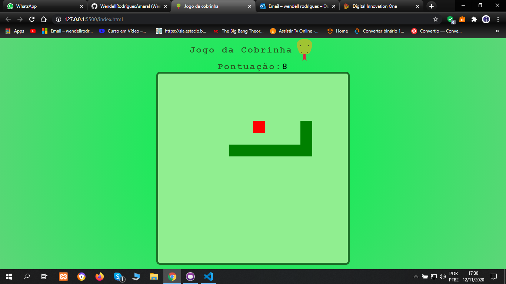

<h1>JOGO DA COBRINHA</h1> 
<h3>Curso da Digital Innovation One</h3>

HTML-CSS-JS

# :snake:

Cada vez que a cobra encosta na comida, é somado um ponto;

Ao encostar na borda da tela, ela sai do outro lado da tela, em qualquer direção que estiver.